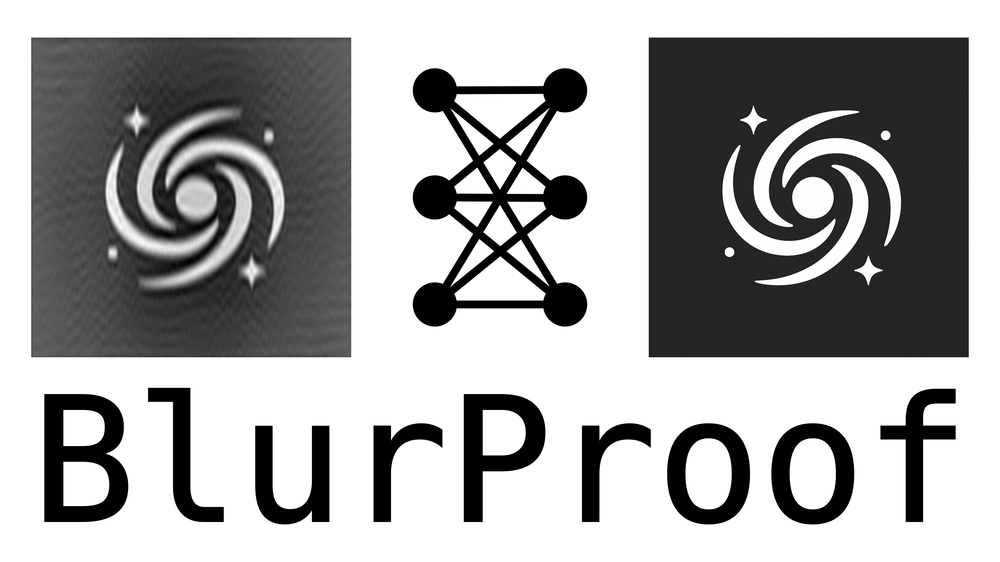

<p align="center">
  
</p>

# BlurProof

**BlurProof** is a deep learning framework for *radio interferometric image deconvolution*. It generates realistic dirty images by convolving clean astronomical images with physically accurate PSFs derived from real interferometer configurations (ALMA, VLA, ngVLA). The model learns to reconstruct the original clean image, effectively learning the inverse of the imaging process.

> **Note:** The model architecture, data preprocessing, and PSF generation pipeline are fully implemented.
> However, the model itself has **not been trained yet** — all scripts and configurations are in place and ready for training.

---

## Overview

In radio interferometry, incomplete sampling of the spatial frequency (u–v) plane produces a dirty image:
[
I_\text{dirty} = I_\text{true} * B_\text{dirty}
]
where (B_\text{dirty}) is the point spread function. **BlurProof** replaces traditional iterative deconvolution (like CLEAN) with a learned U-Net model trained on synthetic data.

The clean images come from the [**Galaxy Zoo 2 dataset**](https://www.kaggle.com/datasets/jaimetrickz/galaxy-zoo-2-images), and the PSFs are generated from realistic interferometer configurations.

---

## Repository Structure

```
BlurProof/
├── train.py                     # Model training entry point
├── array_configurations/        # ALMA / ngVLA / VLA cfg files
└── utilities/                   # PSF generation and visualization tools
```

---

## Installation

```bash
git clone https://github.com/harry353/BlurProof.git
cd BlurProof
python -m venv .venv
source .venv/bin/activate
pip install -r requirements.txt
```

---

## Usage

Generate PSFs:

```bash
python utilities/create_psf.py
```

Inspect samples:

```bash
python utilities/inspect_sample.py
```

Train the model:

```bash
python train.py
```

---

## License

Released under the [MIT License](LICENSE).
